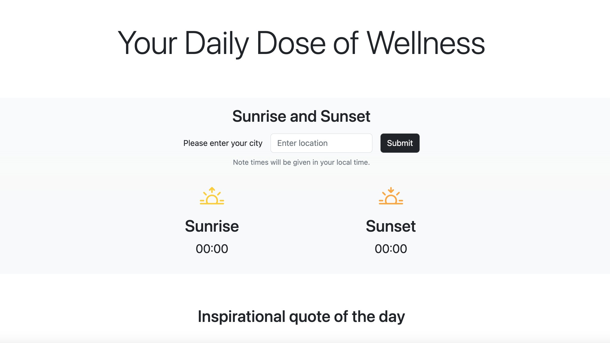

# Daily wellness page

This is a project I created so users can have some pieces of wellness to start their day. The website accesses the [OpenWeather API](https://openweathermap.org/api), an [inspirational quote API](https://api.goprogram.ai/inspiration/docs/), a [horoscope API](https://aztro.sameerkumar.website/) and the [NASA API](https://api.nasa.gov/).

## Table of contents

- [Overview](#overview)
  - [Screenshot](#screenshot)
  - [Links](#links)
- [My process](#my-process)
  - [Built with](#built-with)
  - [What I learned](#what-i-learned)

## Overview

Users should be able to:

- Search for their city and see the sunrise and sunset in their local time
- See the daily insipirational quote
- Select their star sign and see their daily horoscope a long with the NASA photo of the day

### Screenshot

### Links

- Solution URL: [https://ojknox.github.io/Daily-Wellness/](https://ojknox.github.io/Daily-Wellness/)

## My process

### Built with

- HTML
- Bootstrap
- Javascript

### What I learned

- How to access APIs and display the information returned
- Styling with Bootstrap
